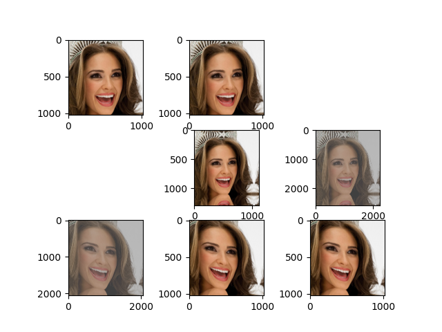

# SISRDM 

### CelebA
- s_block_second = 0.15
- s_noise_second = 0.2
- prob-length=0.89 
- blur-sigma-max=2

### ADE
- s_block_second = 0.15
- s_noise_second = 0.2
- prob-length=0.93 
- blur-sigma-max=3

### etc
- dataloader only running in linux, you change "\\" to "//" to fit windows
- not yet reached SISRDM`s limit ,no time to training anymore

- `cfg_1=1 cfg_2=1: num_step= 120, 180`
- `cfg_1=1 cfg_2=3.5: num_step = 256, 200`
- if train.py `blur-sigma-max=3` then generate.py `blur_sigma_max_second=3` (=2 or =3, which better? not kown without abliation)

## still tidying up
arguments for configurations of the first stage are:

- `num_steps_first`: number of sampling steps.
- `sigma_min_first` & `sigma_max_first`: lowest & highest noise level.
- `rho_first`: time step exponent.
- `cfg_scale_first`: scale of classifier-free guidance.
- `S_churn`: stochasticity strength.
- `S_min` & `S_max`: min & max noise level.
- `S_noise`: noise inflation.

Arguments for configurations of the second stage are:

- `num_steps_second`: number of sampling steps.
- `sigma_min_second` & `sigma_max_second`: lowest & highest noise level.
- `blur_sigma_max_second`: maximum sigma of blurring schedule.
- `rho_second`: time step exponent.
- `cfg_scale_second`: scale of classifier-free guidance.
- `up_scale_second`: scale of upsampling.
- `truncation_sigma_second` & `truncation_t_second`: truncation point of noise & time schedule.
- `s_block_second`: strength of block noise addition.
- `s_noise_second`: strength of stochasticity.

# Dataset Preparation
following SDM

### CelebAMask-HQ preprocessed
https://drive.google.com/file/d/1TKhN9kDvJEcpbIarwsd1_fsTR2vGx6LC/view

## training device
- 1 * V100 32G for pre-testing、program and debug , provided by Visual Computing and Virtual Reality Key Laboratory of Sichuan Province
- 1 * RTX4090 24G , 1 * A100 40G , 1 * A40 48G for stage-1 training, Rent by GPU computing platform
- 1 * A100 40G and 1 * L20 48G and 1 * A100 80G for stage-2 training, Rent by GPU computing platform

## !!!
- !!!  in stage 2,   batch-size=1 > 24G(float32) !!!  , batch-size=3 = 44G(float32)  batch-size=6 = 48G(fp16=True)  
- !!! A100s recommond

## !!! all must fit envionment .espcially scipy!!!  and  xformer!!!

### pick up in paper
```
celebA test:
    \labels\28229.png
    \labels\28177.png
    \labels\28030.png
    \labels\28069.png

ADE val:
    639.png
    317.png
    671.png
    693.png
```
# Acknowledgements

This implementation is based on 
- https://github.com/NVlabs/edm (codebase of EDM)
- https://github.com/THUDM/RelayDiffusion (RDM) 
- https://github.com/WeilunWang/semantic-diffusion-model (SDM) 
- https://github.com/ader47/jittor-jieke-semantic_images_synthesis (SDM + VQVAE)

FID computation is based on 
- https://github.com/THUDM/RelayDiffusion

LPIPS computation is based on 
- https://github.com/richzhang/PerceptualSimilarity

Thanks a lot!

# train
just run `python train_XXX` or run command in scripts `xxx.sh`

# test
just run `python generate_XXX`

# trick(need manual adjust)
- warm up(in training_loop.py : line 156-160): lr = 1e-3 (train 1M) `label = torch.zero_like(label)`, unconditional pretrain
- cfg train(in training_loop.py : line 156-160): radom 10% label = torch.zero_like(label)
- loss scale: when loss = 0.1XXX and hold, loss scale=2 and more bathsize  make it to 0.2XXX, when then again stable to 0.1XXX ,set loss scale to 4 make it to 0.2XXX ... max loss scale 16, at last loss scale=1
- loss scale: in trainloop `t = 32 if images.shape[-1] == 64 else 256` make `t` bigger (may not necessary?)


# trick sp(need manual adjust)
### augment
- warm up : in `trick` open augment `label=zero`
- finetune : manual adjust (in training_loop.py : line 156-160) open augment when `label=zero` 

### augment test
dim = 9
augment_labels = tensor([ 0.0000,  0.0000,  0.0000, -0.0081, -0.1273,  0.5142,  0.5647, -0.6237, -0.6004])
```
# Pixel blitting.
self.xflip              = float(xflip)              # Probability multiplier for x-flip.     .............. = {augment_labels[0]}
self.yflip              = float(yflip)              # Probability multiplier for y-flip.     .............. = {augment_labels[1]}

# Geometric transformations.
self.scale              = float(scale)              # Probability multiplier for isotropic scaling. ....... = {augment_labels[2]}
self.rotate_frac        = float(rotate_frac)        # Probability multiplier for fractional rotation. ..... = {augment_labels[3]}, {augment_labels[4]}
self.aniso              = float(aniso)              # Probability multiplier for anisotropic scaling. ..... = {augment_labels[5]}, {augment_labels[6]}
self.translate_frac     = float(translate_frac)     # Probability multiplier for fractional translation. .. = {augment_labels[7]}, {augment_labels[8]}

# Color transformations. ( all closeed )
self.brightness         = float(brightness)         # Probability multiplier for brightness.
self.contrast           = float(contrast)           # Probability multiplier for contrast.
self.lumaflip           = float(lumaflip)           # Probability multiplier for luma flip.
self.hue                = float(hue)                # Probability multiplier for hue rotation.
self.saturation         = float(saturation)         # Probability multiplier for saturation.
self.brightness_std     = float(brightness_std)     # Standard deviation of brightness.
self.contrast_std       = float(contrast_std)       # Log2 standard deviation of contrast.
self.hue_max            = float(hue_max)            # Range of hue rotation, 1 = full circle.
self.saturation_std     = float(saturation_std)     # Log2 standard deviation of saturation.

```
### after augment pipe: 


## ENV

- pip xformers : -i https://pypi.mirrors.ustc.edu.cn/simple/ 

- torch 2.0.0  <---> xformers 0.0.19
- torch 2.0.1  <---> xformers 0.0.20